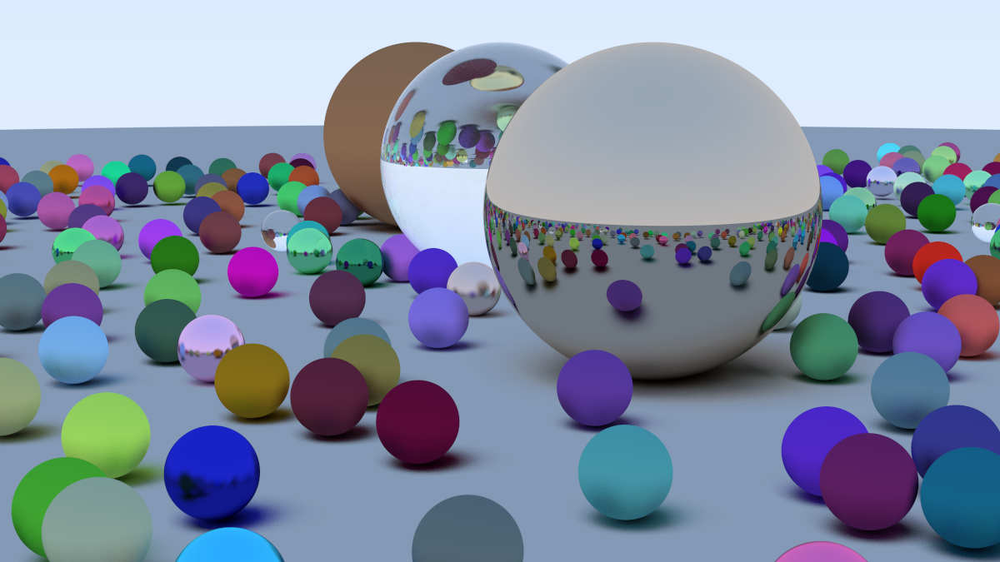

# 🎥 Raytracer

A software raytracing engine built in native C++ for rendering 3D scenes. This project was my first project in C++ and my introduction to several computer graphics concepts.

## 📝 Features

- Utilizes ray-object intersections, shading techniques, antialiasing, gamma correction, and more
- Supports diffuse, metal, and dielectric materials, sumulating accurate light reflection, refraction, and scattering
- Includes a positionable virtual camera with defocus blur and customizable dimensions
- Additional features in progress...

## 🔍 What I Learned

- Programming in C++, covering syntax, conventions, and specific C++ features
- Foundational concepts in computer graphics, applied through raytracing and rendering
- The mathematics and physics behind rendering, particularly vector math and optics

## 🖼️ Results

### Sphere Scene

- 532 spheres with random positions and materials, including metal and glass balls
- 1200x675 pixels, 500 sampled rays per pixel, 50 ray bounce max

## 📚 Reference

- [Ray Tracing in One Weekend](https://raytracing.github.io/) 
