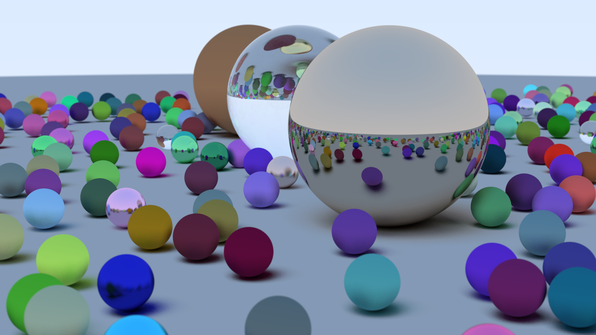
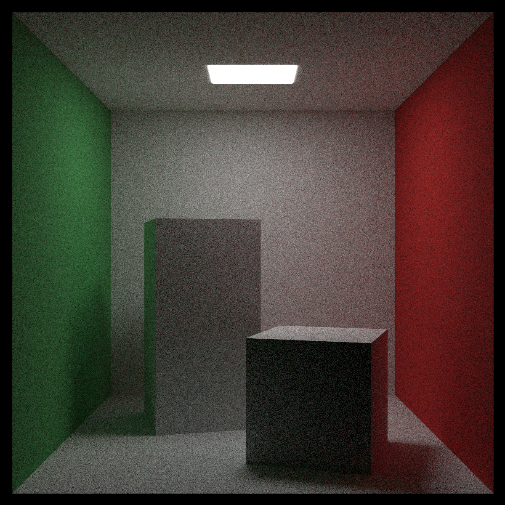

# 🎥 Raytracer

A software raytracing engine built in native C++ for rendering 3D scenes. This project was my first project in C++ and my introduction to several computer graphics concepts.

## 📝 Features

- Utilizes ray-object intersections, shading techniques, antialiasing, gamma correction, texture mapping, and more
- Supports diffuse, metal, and dielectric materials, simulating accurate light reflection, refraction, and scattering
- Includes lighting objects and a positionable virtual camera with defocus blur, motion blur, and customizable dimensions
- Utilizes a bounding volume hierarchy to improve performance (6.6x performance speedup, 85% reduced render times)
- Additional features in progress...

## 🔍 What I Learned

- Programming in C++, covering syntax, conventions, the standard library, and specific C++ features
- Foundational concepts in computer graphics applied through raytracing
- The mathematical foundations behind ray tracing, including linear algebra, geometry, and optics
- Setting up build systems for C++ projects, including CMake and Visual Studio

## 🖼️ Results

### Sphere Scene

- 532 spheres with random positions and materials, including metal and glass balls
- 1200x675 pixels, 500 sampled rays per pixel, 50 ray bounce limit

### Cornell Box

- Bounce lighting from colored quads on transformed box instances
- 1200x1200 pixels, 500 sampled rays per pixel, 50 ray bounce limit

## 📚 Reference

- [Ray Tracing in One Weekend](https://raytracing.github.io/)
