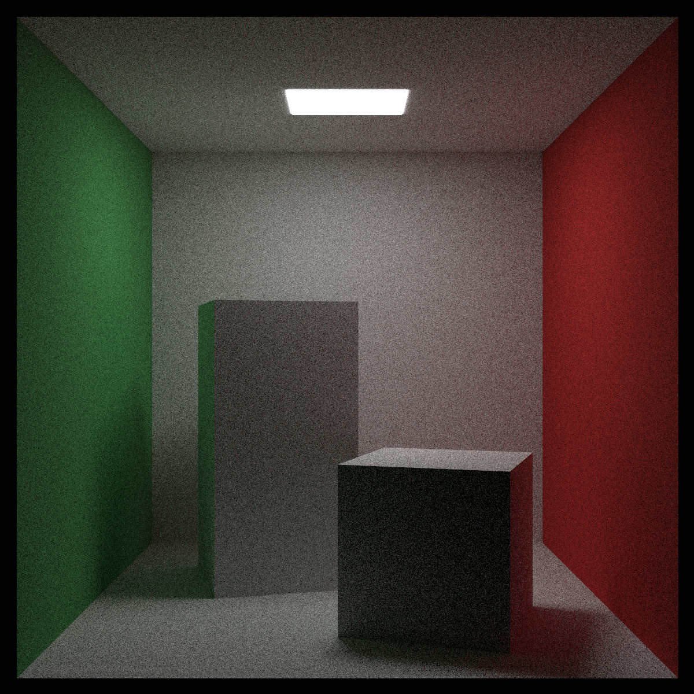

# 🎥 Raytracer

A software raytracing engine built in native C++ for rendering 3D scenes. This project was my first project in C++ and my introduction to several computer graphics concepts.

## 📝 Features

- Utilizes ray-object intersections, shading techniques, antialiasing, gamma correction, texture mapping, and more
- Supports diffuse, metal, dielectric, and emissive materials, simulating accurate light reflection, refraction, and scattering
- Includes lighting objects and a positionable virtual camera with defocus blur, motion blur, and customizable dimensions
- Implements a bounding volume hierarchy to accelerate ray-world intersections (4.6x speedup) and multithreading using a custom thread pool to further improve performance (16x speedup), optimizing performance by 98.6%
- Additional features in progress...

## 🔍 What I Learned

- Programming in C++, covering syntax, conventions, the standard library, multithreaded programming, and specific C++ features
- Foundational concepts in computer graphics applied through raytracing
- The mathematical foundations behind ray tracing, including linear algebra, geometry, and optics
- Setting up build systems for C++ projects, including CMake and Visual Studio, and importing external libraries

## 🛠️ Build and Run

### Build with CMake

1. Make sure [CMake](https://cmake.org/) is installed on your local machine
2. Clone the repository to your local machine
3. Run the following instructions:

```shell
mkdir build
cd build
cmake ..
```

### Running the Program

A collection of sample scenes are provided in main.cpp showing off various features of the raytracer. Rendering parameters can be modified in the functions associated with each scene.

```shell
./Raytracer <scene>
# Example
./Raytracer 5
```

## 🖼️ Results

### Sphere Scene


- 532 spheres with random positions, materials, and motions
- 1200x675 pixels, 500 sampled rays per pixel, 50 ray bounce limit
- Rendered in 282 seconds

### Cornell Box



- Bounce lighting from colored quads on transformed box instances
- 1200x1200 pixels, 500 sampled rays per pixel, 50 ray bounce limit
- Rendered in 1015 seconds

## 📚 Reference

- [Ray Tracing in One Weekend](https://raytracing.github.io/)
